# AI-Powered Mock Interview System
## Visual Diagrams & Schema Documentation for Research Paper

*Document Version: 1.0 | Generated: December 28, 2024*

---

## Table of Contents
1. [System Architecture](#1-system-architecture)
2. [High-Level Data Flow](#2-high-level-data-flow)
3. [Database Schema (ER Diagram)](#3-database-schema-er-diagram)
4. [Interview Session Lifecycle](#4-interview-session-lifecycle)
5. [Voice Processing Pipeline](#5-voice-processing-pipeline)
6. [AI Analysis Generation Flow](#6-ai-analysis-generation-flow)
7. [Component Architecture](#7-component-architecture)
8. [API Endpoint Structure](#8-api-endpoint-structure)
9. [Authentication & Security Flow](#9-authentication--security-flow)
10. [Technology Stack Diagram](#10-technology-stack-diagram)

---

## 1. System Architecture

### 1.1 Complete System Overview

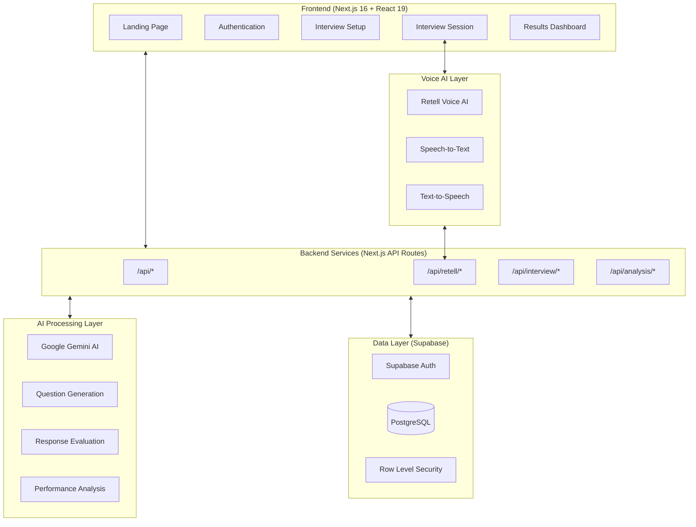

### 1.2 Three-Tier Architecture

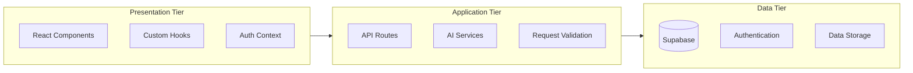

---

## 2. High-Level Data Flow

### 2.1 Complete Interview Flow

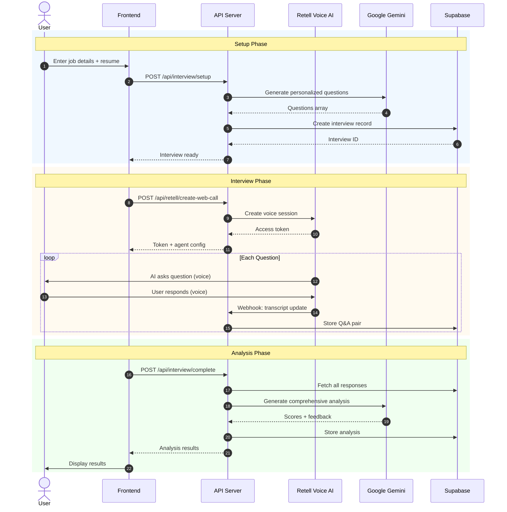

### 2.2 Real-Time Voice Communication

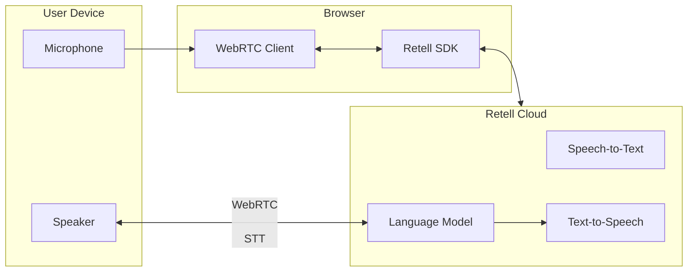

---

## 3. Database Schema (ER Diagram)

### 3.1 Entity-Relationship Diagram

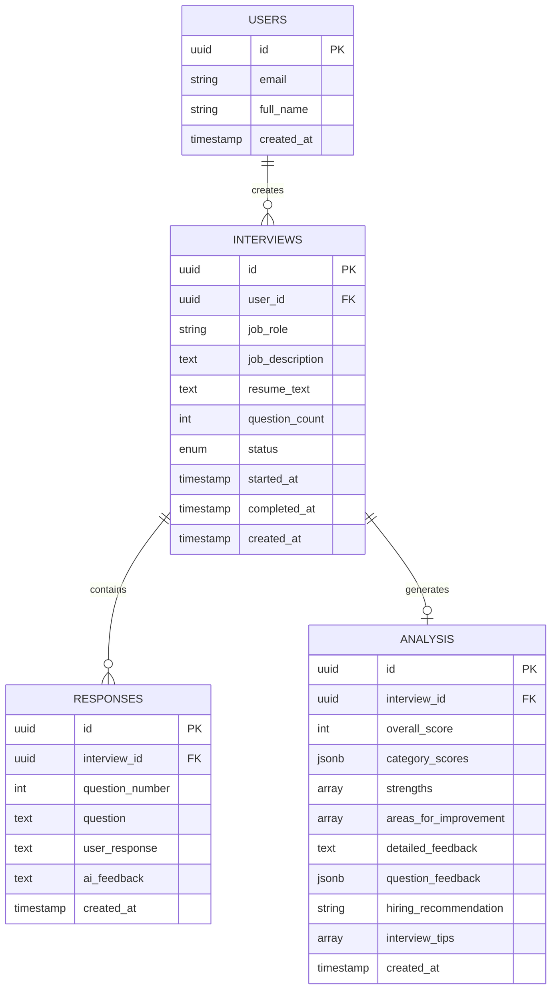

### 3.2 Table Specifications

| Table | Description | Row-Level Security |
|-------|-------------|-------------------|
| `interviews` | Stores interview sessions with job details | Users can only access their own records |
| `responses` | Stores Q&A pairs during interviews | Access via interview ownership |
| `analysis` | Stores AI-generated performance analysis | Access via interview ownership |

### 3.3 Status State Machine

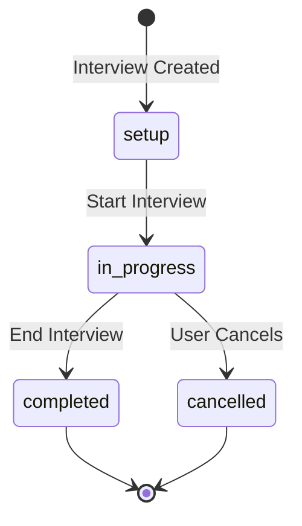

---

## 4. Interview Session Lifecycle

### 4.1 State Transitions

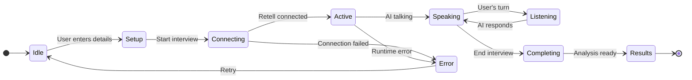

### 4.2 Interview Session Timeline

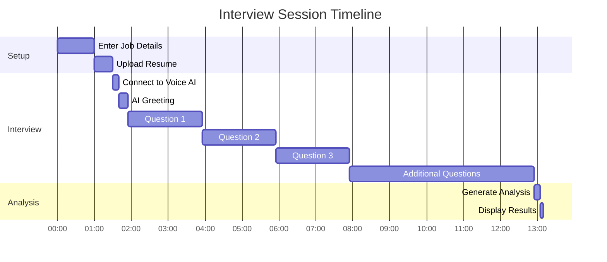

---

## 5. Voice Processing Pipeline

### 5.1 Audio Processing Flow

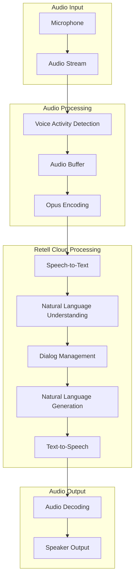

### 5.2 Transcript Update Flow

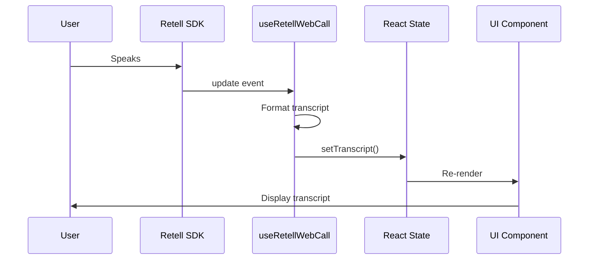

---

## 6. AI Analysis Generation Flow

### 6.1 Analysis Pipeline

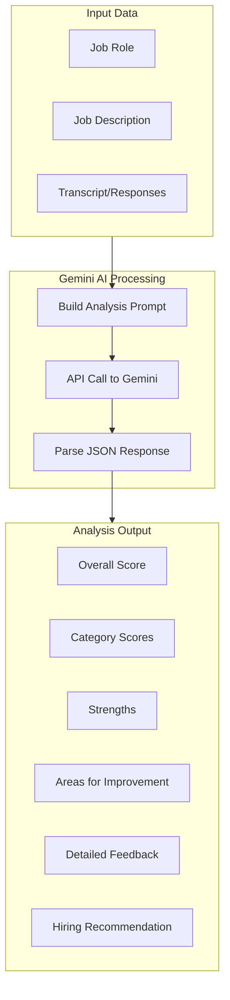

### 6.2 Scoring Categories

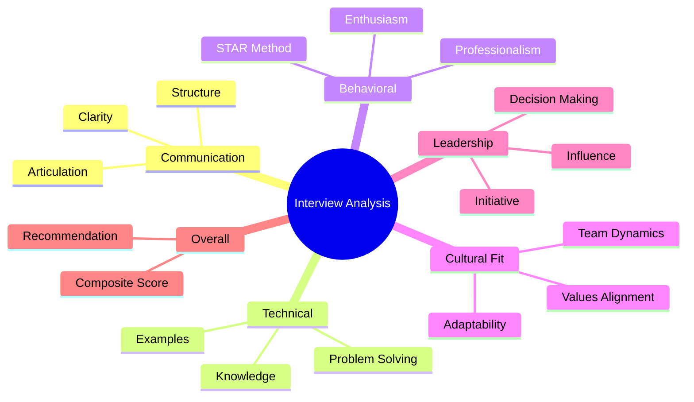

### 6.3 Score Distribution

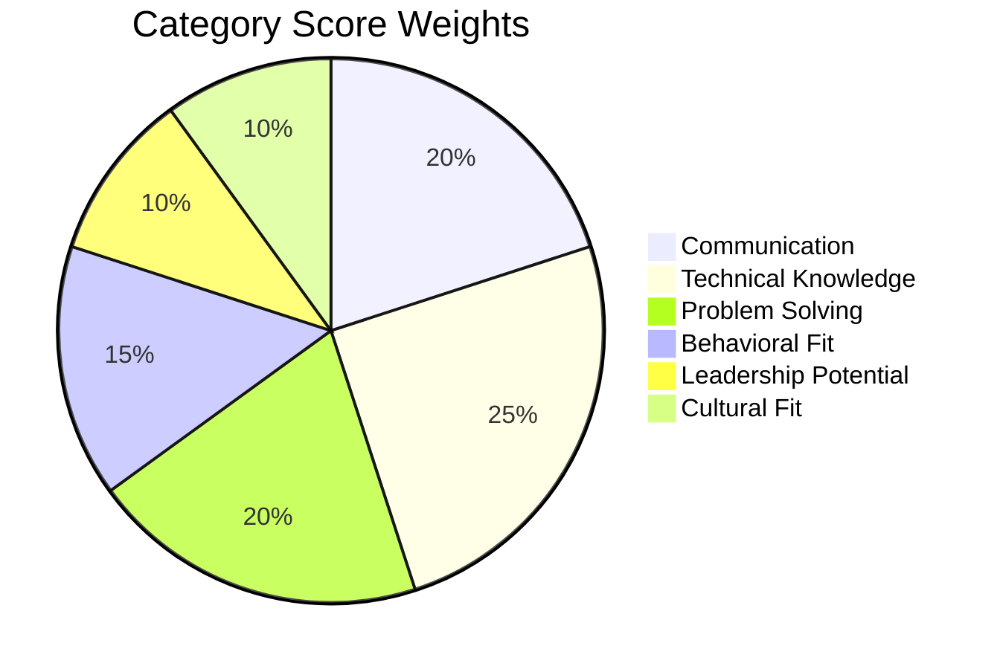

---

## 7. Component Architecture

### 7.1 Frontend Component Hierarchy

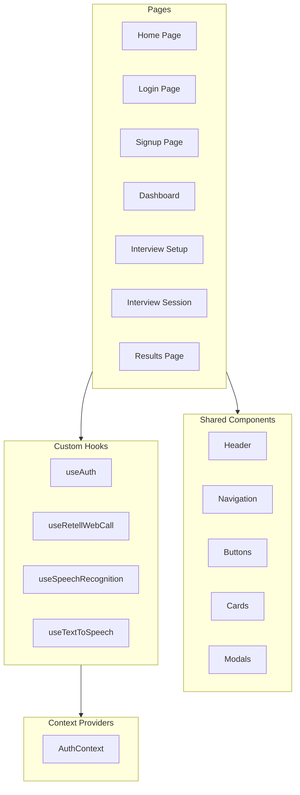

### 7.2 Interview Page Component Structure

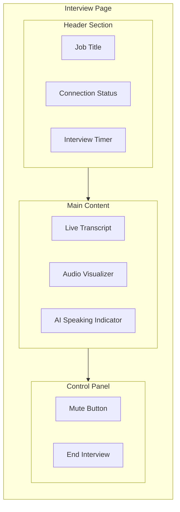

---

## 8. API Endpoint Structure

### 8.1 REST API Architecture

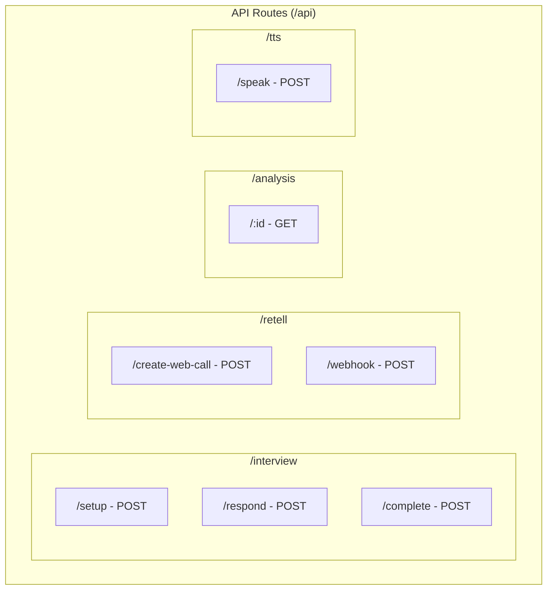

### 8.2 API Request/Response Flow

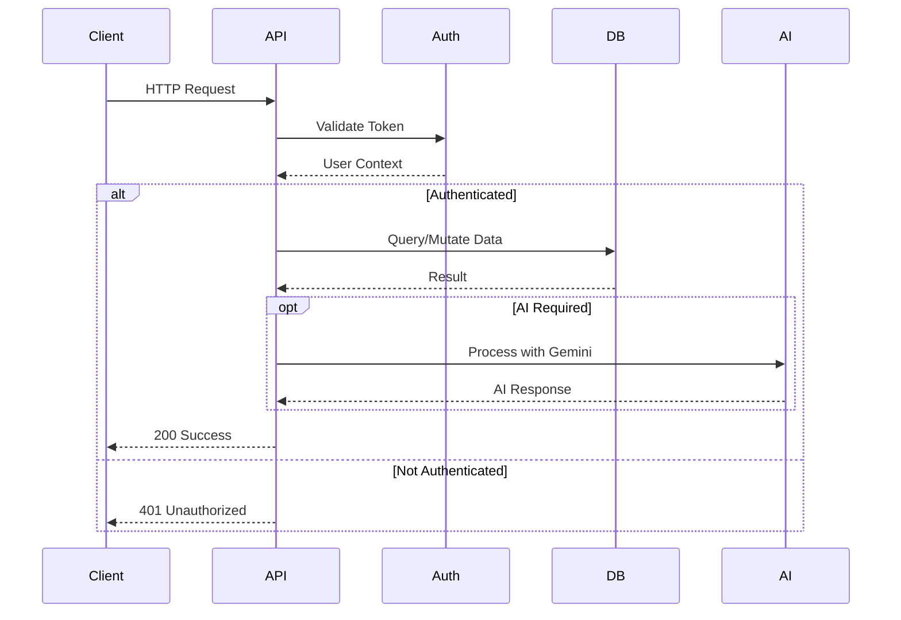

---

## 9. Authentication & Security Flow

### 9.1 Authentication Flow

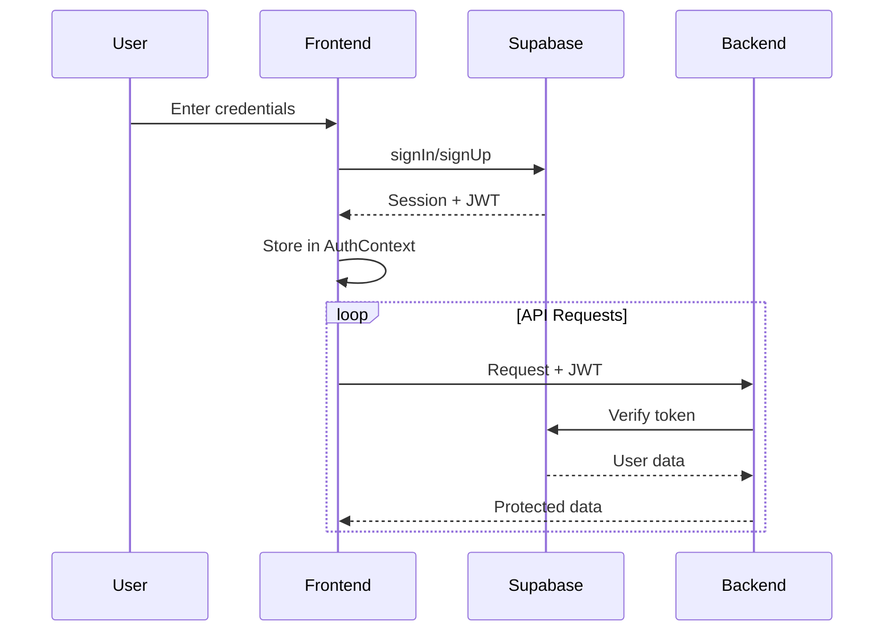

### 9.2 Row-Level Security Model

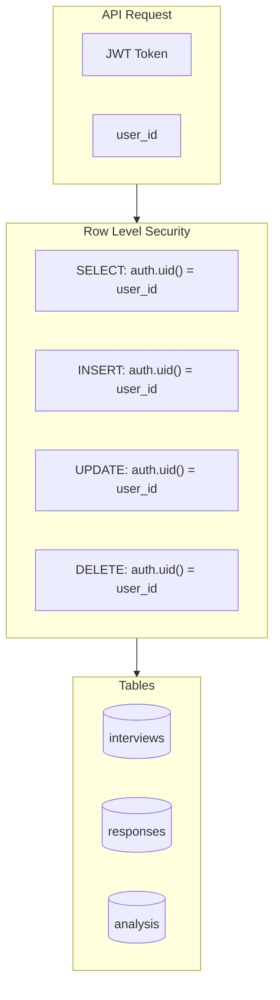

---

## 10. Technology Stack Diagram

### 10.1 Complete Technology Stack

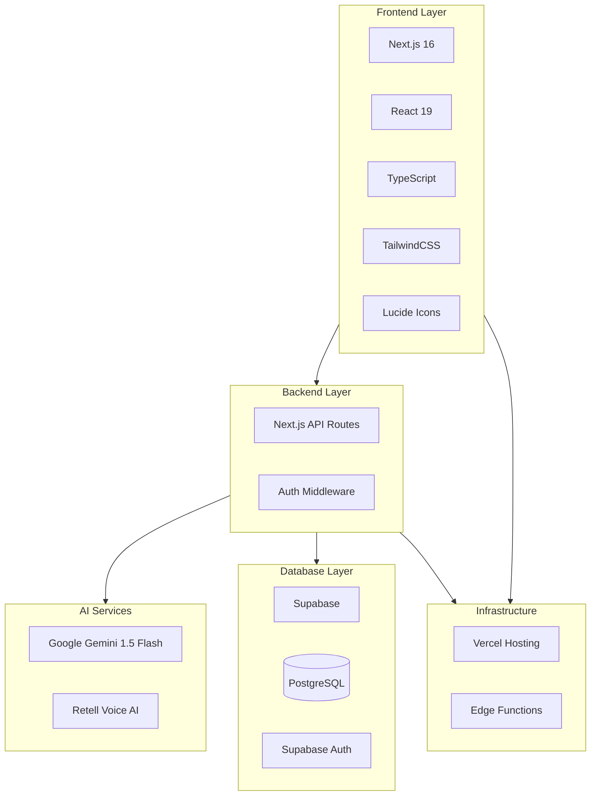

### 10.2 Technology Comparison Table

| Layer | Technology | Purpose | Alternative |
|-------|------------|---------|-------------|
| **Frontend** | Next.js 16 | React Framework | Remix, Nuxt |
| **UI** | React 19 | Component Library | Vue, Svelte |
| **Styling** | TailwindCSS | Utility CSS | Styled Components |
| **Voice AI** | Retell | Voice Conversations | Twilio, Vonage |
| **LLM** | Gemini 1.5 Flash | AI Processing | GPT-4, Claude |
| **Database** | Supabase | Backend-as-a-Service | Firebase, Neon |
| **Auth** | Supabase Auth | Authentication | Auth0, Clerk |
| **Hosting** | Vercel | Deployment | Netlify, AWS |

---

## Key Metrics & Performance

### System Throughput

```mermaid
xychart-beta
    title "Interview Processing Metrics"
    x-axis ["Setup", "Connect", "Q1", "Q2", "Q3", "Analysis", "Results"]
    y-axis "Time (seconds)" 0 --> 15
    bar [3, 5, 0.5, 0.5, 0.5, 10, 1]
```

### Response Latency Distribution

| Component | Average Latency | P95 Latency |
|-----------|-----------------|-------------|
| Voice Processing | 200ms | 350ms |
| Gemini API | 800ms | 1500ms |
| Database Query | 50ms | 120ms |
| Analysis Generation | 8-12s | 15s |

---

## Summary

This document provides comprehensive visual representations of the AI-Powered Mock Interview system architecture, suitable for inclusion in research papers. The diagrams cover:

1. **System Architecture** - High-level component interaction
2. **Data Flow** - End-to-end information processing
3. **Database Design** - ER diagrams and schema specifications
4. **Session Lifecycle** - State management and transitions
5. **Voice Pipeline** - Real-time audio processing
6. **AI Analysis** - Machine learning integration
7. **Component Structure** - Frontend architecture
8. **API Design** - RESTful endpoint organization
9. **Security Model** - Authentication and authorization
10. **Technology Stack** - Complete tool ecosystem

---

*Generated for academic research purposes*
*AI Mock Interview Platform - Technical Architecture Documentation*
