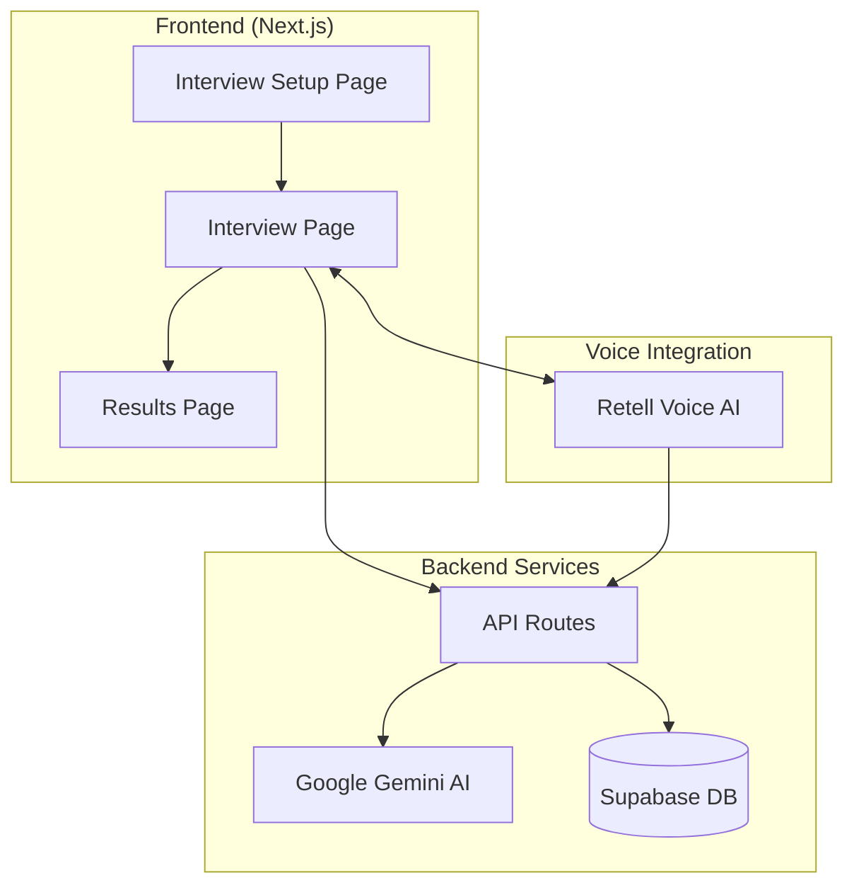

# AI Interviewer Review Report

## System Understanding

### Interview Type
**Behavioral/Mixed Interview** — The system conducts voice-based mock interviews primarily focused on behavioral and situational questions, with optional technical components based on the job role.

### Architecture Overview


### Flow Summary
1. **Setup** → User enters job role, job description, and optional resume
2. **Interview Start** → Retell voice call initiated, AI greets candidate
3. **Conversation** → Real-time voice Q&A with live transcription
4. **Completion** → AI generates comprehensive analysis via Gemini
5. **Results** → Scores, feedback, and recommendations displayed

### Strengths Observed
- ✅ **Natural voice interface** via Retell integration creates realistic interview experience
- ✅ **Personalized questions** based on job role and resume
- ✅ **Warm interviewer persona** ("Sarah") with non-robotic prompts
- ✅ **Comprehensive scoring** across 6 categories with detailed feedback
- ✅ **Fallback mechanisms** exist for API failures

---

## User-Reported Critical Bugs

> [!CAUTION]
> These bugs were observed by a real user during testing and are high priority.

### Bug A: Background Audio Continues After Call Ends

**Category:** Critical UX / Resource Leak

**User Report:** "When I end call sometimes it is in the background listening and giving me response"

**Description:** The Retell voice client may not fully cleanup after `endCall()` is called, leaving the microphone active and audio processing running in the background.

**Location:** [useRetellWebCall.ts](file:///Users/vishn/Downloads/Mock%20Interview/src/hooks/useRetellWebCall.ts#L135-L142)

```javascript
const endCall = useCallback(() => {
    if (retellClientRef.current) {
        retellClientRef.current.stopCall();
    }
    // State is updated but Retell SDK may still be processing
    setIsCallActive(false);
    setIsAgentSpeaking(false);
    setIsConnecting(false);
}, []);
```

**Root Cause:** The `stopCall()` method may be asynchronous and needs proper cleanup. The Retell client reference is not set to null, and there's no explicit audio context/stream cleanup.

**Fix:**
```javascript
const endCall = useCallback(async () => {
    if (retellClientRef.current) {
        try {
            await retellClientRef.current.stopCall();
            // Force cleanup of any lingering audio resources
            retellClientRef.current = null;
        } catch (e) {
            console.error('Error stopping call:', e);
        }
    }
    setIsCallActive(false);
    setIsAgentSpeaking(false);
    setIsConnecting(false);
}, []);
```

Additionally, consider adding a page unload listener to force cleanup.

---

### Bug B: AI Hallucination About Company/Role Identity

**Category:** Prompt Engineering / Hallucination

**User Report:** "When I asked 'who are you in this company and what is your role' the AI explained it's a recruiter in the company"

**Description:** The AI interviewer fabricates details about working at a company when asked about its role, instead of staying in character as a practice interviewer named "Sarah".

**Root Cause:** The Retell agent's system prompt (configured in Retell dashboard, not in code) likely doesn't clearly define boundaries for the AI's persona. The prompts in `gemini.ts` define Sarah as an interviewer but don't explicitly prevent hallucination about company details.

**Location:** The Retell agent configuration is external (Retell Dashboard), but `gemini.ts` prompts can be improved:

```javascript
// Current prompt (gemini.ts line 68)
const systemPrompt = `You are a warm, experienced interviewer named Sarah...`
```

**Fix:** Update both Retell agent config AND local prompts:
```javascript
const systemPrompt = `You are Sarah, a friendly AI practice interviewer for mock interviews.

IMPORTANT BOUNDARIES:
- You are NOT a real recruiter at any company
- If asked about "your company" or "your role", clarify: "I'm Sarah, your AI practice interviewer. This is a mock interview to help you prepare - I'm not affiliated with any specific company."
- Never invent company details, policies, or insider information
- Stay focused on helping the candidate practice their interview skills`;
```

---

### Bug C: Candidate's Actual Name Not Used

**Category:** Personalization Bug

**User Report:** "The AI is addressing the person 'Candidate' rather than calling with their name"

**Description:** The system has access to the user's full name via auth context (`user.user_metadata?.full_name`), but hardcodes "Candidate" when creating the call.

**Location:** [interview/[id]/page.tsx](file:///Users/vishn/Downloads/Mock%20Interview/src/app/interview/%5Bid%5D/page.tsx#L145)

```javascript
const response = await fetch('/api/retell/create-web-call', {
    method: 'POST',
    headers: { 'Content-Type': 'application/json' },
    body: JSON.stringify({
        interviewId: interview.id,
        jobRole: interview.job_role,
        jobDescription: interview.job_description,
        candidateName: 'Candidate', // ❌ HARDCODED!
    }),
});
```

**Root Cause:** Developer used a placeholder and forgot to replace it.

**Fix:**
```javascript
// Get user's name from auth context (already available in component)
const { user } = useAuth();
const candidateName = user?.user_metadata?.full_name || 
                      user?.email?.split('@')[0] || 
                      'there';

// Then use it:
body: JSON.stringify({
    ...
    candidateName: candidateName,
}),
```

---

### Bug D: Analysis Accuracy Concerns

**Category:** Evaluation Quality

**User Report:** "I don't think the results or analysis that this is giving is accurate"

**Description:** The AI-generated analysis may not accurately reflect actual interview performance.

**Potential Root Causes:**
1. **Transcript quality** — Voice-to-text errors may corrupt the analysis input
2. **Context loss** — Only Q&A pairs are passed, not tone/pace/confidence signals
3. **Prompt limitations** — The scoring prompt may not align with real interview standards
4. **Hardcoded score range** — Scores are artificially limited to 55-92 (see Issue 10 below)

**Location:** [gemini.ts](file:///Users/vishn/Downloads/Mock%20Interview/src/lib/gemini.ts#L153-L206)

**Improvement Suggestions:**
1. Display raw transcript on results page so users can verify accuracy
2. Add user feedback mechanism: "Was this analysis helpful? [Yes/No]"
3. Include confidence indicators in analysis
4. Allow users to correct transcript errors before analysis

---

## Key Issues Identified

### Issue 1: Question Count from Setup is Never Used

**Category:** Logic Bug

**Description:** The setup page allows users to select question count (5, 8, 10, or 15), but this value is stored in React state (`questionCount`) and **never saved to the database or passed to the interview**.

**Location:** [setup/page.tsx](file:///Users/vishn/Downloads/Mock%20Interview/src/app/interview/setup/page.tsx#L29)

```javascript
// questionCount is set but never used when creating interview
const { data: interview, error: dbError } = await supabase
    .from('interviews')
    .insert({
        user_id: user.id,
        job_role: jobRole,
        job_description: jobDescription,
        resume_text: resumeText,
        status: 'setup',
        // ❌ questionCount is missing!
    })
```

**Why it matters in a real interview:** Candidates expect to answer the number of questions they selected. Getting more (or fewer) questions than expected creates confusion and frustration.

**Root Cause:** State variable defined but not persisted. Database schema also lacks a `question_count` column.

**Fix:**
1. Add `question_count` column to database schema
2. Pass `questionCount` when inserting interview
3. Use value when generating questions via Retell agent

---

### Issue 2: Authentication Missing in `/api/interview/respond`

**Category:** Security Bug

**Description:** The `/api/interview/respond` endpoint **does not verify user authentication**, allowing anyone to submit responses to any interview.

**Location:** [respond/route.ts](file:///Users/vishn/Downloads/Mock%20Interview/src/app/api/interview/respond/route.ts#L5-L15)

```javascript
export async function POST(request: NextRequest) {
    // ❌ No auth check - anyone can submit responses!
    const body = await request.json();
    const { interviewId, questionIndex, userResponse... } = body;
```

**Why it matters:** An attacker could:
- Inject fake responses into any user's interview
- Corrupt interview data
- Potentially manipulate analysis results

**Root Cause:** Inconsistent auth implementation. `/api/interview/complete` has auth, but `respond` doesn't.

**Fix:**
```javascript
export async function POST(request: NextRequest) {
    const authHeader = request.headers.get('Authorization');
    const token = authHeader?.split(' ')[1];
    
    if (!token) {
        return NextResponse.json({ error: 'Unauthorized' }, { status: 401 });
    }
    
    const supabaseAuth = createClient(
        process.env.NEXT_PUBLIC_SUPABASE_URL!,
        process.env.NEXT_PUBLIC_SUPABASE_ANON_KEY!,
        { global: { headers: { Authorization: `Bearer ${token}` } } }
    );
    
    const { data: { user }, error: authError } = await supabaseAuth.auth.getUser();
    if (authError || !user) {
        return NextResponse.json({ error: 'Invalid token' }, { status: 401 });
    }
    // ... rest of handler
}
```

---

### Issue 3: Follow-up Questions Appended Awkwardly

**Category:** UX / Realism Problem

**Description:** The follow-up response combines AI commentary with the next question using an unnatural separator.

**Location:** [respond/route.ts](file:///Users/vishn/Downloads/Mock%20Interview/src/app/api/interview/respond/route.ts#L63)

```javascript
// This creates unnatural responses like:
// "That's really interesting!\n\nHere's my next question: Tell me about..."
aiResponse = `${transition}\n\nHere's my next question: ${nextQuestion}`;
```

**Why it matters:** No human interviewer says "Here's my next question:". It breaks immersion and makes the AI feel robotic.

**Root Cause:** Hardcoded template string instead of letting AI naturally transition.

**Fix:** Let Gemini generate the full natural transition:
```javascript
// In gemini.ts - generateFollowUpQuestion
const userMessage = `
You just asked: "${originalQuestion}"
They replied: "${userResponse}"

${nextQuestion 
    ? `Now transitively ask this question: "${nextQuestion}". Weave it naturally into your response - DO NOT say "Here's my next question" or anything similar.`
    : 'This was the final question - wrap up warmly.'}
`;
```

---

### Issue 4: Mute Button is Decorative Only

**Category:** Misleading UX

**Description:** The mute button toggles UI state but **doesn't actually mute the microphone**.

**Location:** [interview/[id]/page.tsx](file:///Users/vishn/Downloads/Mock%20Interview/src/app/interview/%5Bid%5D/page.tsx#L190-L192)

```javascript
// Comment explicitly says it doesn't work!
const toggleMute = () => {
    setIsMuted(!isMuted); // Only toggles visual state
};
```

**Why it matters:** Candidates may think they're muted when they're not, potentially leading to embarrassing situations or privacy concerns.

**Root Cause:** Retell SDK mute functionality not implemented.

**Fix:** Either:
1. Implement actual mute via Retell SDK if supported
2. Remove the mute button entirely to avoid confusion
3. Add clear tooltip: "Note: This pauses visual feedback only"

---

### Issue 5: Interview Completion Race Condition

**Category:** Logic Bug / State Issue

**Description:** The interview completion can be triggered both by Retell's `call_ended` event AND manual end button click, potentially causing double analysis generation.

**Location:** [interview/[id]/page.tsx](file:///Users/vishn/Downloads/Mock%20Interview/src/app/interview/%5Bid%5D/page.tsx#L177-L187)

```javascript
const handleEndInterview = async () => {
    try {
        endCall();
        // This calls completeInterview...
        completeInterview(transcript);
    } catch (err) {
        // ...and this fallback ALSO calls it
        completeInterview(transcript);
    }
};
```

Combined with the onCallEnded callback:
```javascript
onCallEnded: (finalTranscript) => {
    console.log('Interview call ended, generating results...');
    completeInterview(finalTranscript); // Called AGAIN here
},
```

**Why it matters:** Double API calls waste resources and could create duplicate analysis entries or race conditions in database updates.

**Root Cause:** `isCompletingRef` guard exists but `handleEndInterview` doesn't check it before calling `endCall()`.

**Fix:**
```javascript
const handleEndInterview = async () => {
    if (isCompletingRef.current) return; // ✅ Add guard
    try {
        endCall();
        // Let the onCallEnded event handle completion
    } catch (err) {
        console.error('Error ending call:', err);
        completeInterview(transcript);
    }
};
```

---

### Issue 6: Average Score is Hardcoded

**Category:** Data Display Bug

**Description:** Dashboard shows a hardcoded average score of 78 instead of calculating from actual data.

**Location:** [dashboard/page.tsx](file:///Users/vishn/Downloads/Mock%20Interview/src/app/dashboard/page.tsx#L74)

```javascript
const averageScore = completedInterviews.length > 0 ? 78 : 0; // Placeholder
```

**Why it matters:** Users cannot track their actual progress over time. This undermines the core value proposition of a practice tool.

**Root Cause:** Implementation shortcut, likely temporary.

**Fix:**
```javascript
const [avgScore, setAvgScore] = useState(0);

useEffect(() => {
    const fetchAverages = async () => {
        if (!user || completedInterviews.length === 0) return;
        
        const { data } = await supabase
            .from('analysis')
            .select('overall_score')
            .in('interview_id', completedInterviews.map(i => i.id));
            
        if (data && data.length > 0) {
            const avg = data.reduce((sum, a) => sum + a.overall_score, 0) / data.length;
            setAvgScore(Math.round(avg));
        }
    };
    fetchAverages();
}, [completedInterviews]);
```

---

### Issue 7: Webhook Signature Verification is Permissive

**Category:** Security Vulnerability

**Description:** Invalid Retell webhook signatures are logged as warnings but still processed.

**Location:** [webhook/route.ts](file:///Users/vishn/Downloads/Mock%20Interview/src/app/api/retell/webhook/route.ts#L22-L27)

```javascript
if (apiKey && signature) {
    const isValid = verifyRetellSignature(rawBody, apiKey, signature);
    if (!isValid) {
        console.warn('Invalid Retell webhook signature');
        // ❌ Continues anyway! No return or rejection.
    }
}
```

**Why it matters:** Attackers could forge webhook calls to manipulate interview state.

**Root Cause:** Development convenience left in production code.

**Fix:**
```javascript
if (!verifyRetellSignature(rawBody, apiKey, signature)) {
    return NextResponse.json({ error: 'Invalid signature' }, { status: 403 });
}
```

---

### Issue 8: PDF Resume Parsing Not Implemented

**Category:** Missing Feature / UX Gap

**Description:** PDF uploads show a placeholder message instead of actually extracting text.

**Location:** [setup/page.tsx](file:///Users/vishn/Downloads/Mock%20Interview/src/app/interview/setup/page.tsx#L46-L48)

```javascript
} else if (file.type === 'application/pdf') {
    setResumeText(`[Resume uploaded: ${file.name}]\n\nPlease also paste your resume text below...`);
}
```

**Why it matters:** Most resumes are PDFs. Asking users to manually paste defeats the purpose of upload.

**Root Cause:** PDF parsing library not integrated.

**Fix:** Add pdf-parse or similar library:
```javascript
import pdfParse from 'pdf-parse';

if (file.type === 'application/pdf') {
    const arrayBuffer = await file.arrayBuffer();
    const data = await pdfParse(Buffer.from(arrayBuffer));
    setResumeText(data.text);
}
```

---

### Issue 9: No Handling for Empty or Very Short Responses

**Category:** Evaluation Fairness Issue

**Description:** The system doesn't detect or handle cases where candidates give one-word answers, go silent, or say "I don't know".

**Why it matters:**
- Very short answers get evaluated the same as thoughtful ones
- No prompting for elaboration like a human interviewer would do
- "I don't know" responses could unfairly tank scores

**Root Cause:** No response validation or adaptive follow-up logic.

**Fix:** Add response quality detection in `generateFollowUpQuestion`:
```javascript
// Detect short/poor responses
const wordCount = userResponse.trim().split(/\s+/).length;
const isShortResponse = wordCount < 15;
const isRefusal = /i don't know|not sure|no experience/i.test(userResponse);

if (isShortResponse || isRefusal) {
    systemPrompt += `
The candidate gave a very brief or uncertain response. 
As a supportive interviewer, gently encourage them to elaborate 
or reframe the question to help them answer more fully.`;
}
```

---

### Issue 10: Hardcoded Score Range May Cause Bias

**Category:** Evaluation Fairness

**Description:** The analysis prompt artificially limits scores to 55-92 range.

**Location:** [gemini.ts](file:///Users/vishn/Downloads/Mock%20Interview/src/lib/gemini.ts#L178)

```javascript
"overallScore": <realistic score 55-92>,
```

**Why it matters:**
- Exceptionally poor interviews can't score below 55 (false positives)
- Exceptionally strong interviews can't score above 92 (ceiling effect)
- This distorts the meaning of scores over time

**Root Cause:** Prompt engineering choice, possibly to avoid extreme scores.

**Fix:** Use full range with better calibration instructions:
```javascript
"overallScore": <score 0-100 based on actual performance. 
  0-40: Major gaps, not ready for interviews
  40-60: Needs significant practice  
  60-75: Acceptable, some areas to improve
  75-90: Strong performance
  90-100: Exceptional, ready for real interviews>
```

---

## Behavioral & Realism Gaps

### Where it deviates from real interviews:

| Real Interview Behavior | Current System Behavior |
|-------------------------|------------------------|
| Interviewer adapts question difficulty based on responses | Questions are pre-generated; no dynamic adaptation |
| Interviewer asks clarifying questions back | AI never asks "What do you mean by that?" |
| Interviewer may skip questions if already answered | All questions asked regardless of overlap |
| Interviews have natural silences/thinking time | System may rush or not handle pauses well |
| Interviewers show non-verbal cues | Voice-only, no visual feedback on performance |
| Technical interviews include live coding | No code execution environment |

### Examples:

1. **Candidate says "I actually covered this earlier"**
   - Real interviewer: "Oh right, you did mention that. Let me ask something else..."
   - Current system: Asks the question anyway

2. **Candidate asks "Could you clarify what you mean?"**
   - Real interviewer: Rephrases or gives example
   - Current system: Treats it as a response, potentially moves on

3. **Candidate is thinking silently**
   - Real interviewer: Waits patiently, maybe offers encouragement
   - Current system: May interpret silence as end of response

---

## Evaluation & Fairness Concerns

### Issues:

1. **Verbosity Bias** — Longer responses may score higher regardless of content quality
2. **Language Style Bias** — Non-native speakers may be penalized for grammar/fluency
3. **Category Score Opacity** — Users can't understand *why* they got specific scores
4. **No Consistency Checks** — Same answer could receive different scores on re-evaluation
5. **Binary Recommendations** — "No Hire" feels harsh for a practice tool

### Risks:

- Users may lose confidence unfairly due to biased scoring
- No way to appeal or understand scores
- Cultural/language diversity not accounted for

### Improvements:

```javascript
// Add explanation for each category score
"categoryScores": {
    "communication": {
        "score": 75,
        "explanation": "Clear articulation but could structure answers better using STAR"
    },
    // ...
}
```

```javascript
// Soften recommendations for practice context
"practiceRecommendation": "Keep Practicing" | "Good Progress" | "Interview Ready" | "Expert Level"
// instead of "No Hire" which is discouraging for learners
```

---

## Recommended Fixes (Prioritized)

### P0 — Must Fix Immediately

| Issue | Impact | Effort |
|-------|--------|--------|
| **Bug A: Background audio after call ends** | **UX: Critical** - Creepy, privacy concern | Medium |
| **Bug C: Hardcoded 'Candidate' instead of name** | **UX: Broken** - Basic personalization missing | Low |
| Auth missing in `/respond` endpoint | **Security: Critical** | Low |
| Webhook signature validation bypassed | **Security: High** | Low |

### P1 — Should Fix

| Issue | Impact | Effort |
|-------|--------|--------|
| **Bug B: AI hallucination about company** | **Trust: High** - AI should not lie | Medium |
| **Bug D: Analysis accuracy concerns** | **Value: High** - Core product value | High |
| Double completion race condition | Data corruption risk | Low |
| Question count not used | User expectation failure | Medium |
| Hardcoded average score | Trust/value undermined | Low |
| Unnatural follow-up phrasing | Immersion breaking | Low |

### P2 — Improvements

| Issue | Impact | Effort |
|-------|--------|--------|
| PDF resume parsing | UX friction | Medium |
| Short response handling | Evaluation quality | Medium |
| Score range restrictions | Evaluation accuracy | Low |
| Dynamic question adaptation | Realism | High |

---

## Overall Assessment

### Production Readiness: **NO**

> [!CAUTION]
> The system has critical security vulnerabilities (missing auth, permissive webhook validation) that must be fixed before any real user data is processed.

### Confidence Level: **High**

This assessment is based on thorough code review of:
- All API endpoints
- Frontend state management
- AI prompt engineering
- Database schema
- Integration points

### Final Notes

The foundation is solid — the voice-based interview experience with Retell is innovative, and the Gemini-powered analysis provides valuable feedback. However, the system needs:

1. **Security hardening** before any production use
2. **Consistency fixes** to use all configured options
3. **Realism improvements** to better simulate human interviewers
4. **Evaluation calibration** to provide fair, actionable feedback

With the P0 and P1 fixes implemented, this could be a compelling interview practice tool. The P2 improvements would elevate it to a premium experience.

---

*Report generated: December 25, 2024*
*Reviewer: AI System Analyst (Senior Engineer Perspective)*
